# OPN Commerce Backend

A modern e-commerce backend built with **NestJS**, implementing **Domain-Driven Design (DDD)**, **Onion Architecture**, and **CQRS** patterns.

## 🏗️ **Architecture Overview**

This project follows enterprise-grade architectural patterns:

- **Domain-Driven Design (DDD)**: Business logic encapsulated in domain entities and value objects
- **Onion Architecture**: Clear separation of concerns with dependency inversion
- **CQRS**: Command Query Responsibility Segregation for scalable read/write operations
- **Repository Pattern**: Abstract data access layer
- **Value Objects**: Immutable objects representing business concepts

### **Architecture Layers**

```
┌─────────────────────────────────────────────────┐
│                Presentation                     │ ← Controllers, Guards, Decorators
├─────────────────────────────────────────────────┤
│                Application                      │ ← Use Cases (Commands/Queries), DTOs
├─────────────────────────────────────────────────┤
│                Infrastructure                   │ ← Repositories, External Services
├─────────────────────────────────────────────────┤
│                Domain                           │ ← Entities, Value Objects, Business Logic
└─────────────────────────────────────────────────┘
```

### **Project Structure**

```
src/
├── modules/
│   └── users/                          # User domain module
│       ├── domain/                     # Core business logic
│       │   ├── entities/               # Domain entities
│       │   │   ├── user.entity.ts      # User aggregate root
│       │   │   └── user-address.entity.ts  # User address entity
│       │   ├── value-objects/          # Immutable value objects
│       │   │   ├── email.vo.ts         # Email validation & normalization
│       │   │   ├── password.vo.ts      # Password hashing
│       │   │   ├── address.vo.ts       # Physical address
│       │   │   ├── location.vo.ts      # GPS coordinates for delivery
│       │   │   └── gender.vo.ts        # Gender enumeration
│       │   └── repositories/           # Repository interfaces
│       ├── application/                # Application services & use cases
│       │   ├── commands/               # Write operations (CQRS)
│       │   ├── queries/                # Read operations (CQRS)
│       │   ├── handlers/               # Command/Query handlers
│       │   ├── use-cases/              # Business use cases
│       │   ├── dto/                    # Data transfer objects
│       │   └── validators/             # Business validation services
│       ├── infrastructure/             # External concerns
│       │   ├── persistence/            # Data persistence (in-memory for now)
│       │   └── repositories/           # Repository implementations
│       └── presentation/               # API controllers & guards
│           ├── controllers/            # REST endpoints
│           ├── guards/                 # Authentication & authorization
│           └── decorators/             # Custom decorators
└── main.ts                            # Application bootstrap
```

### **Entity Relationship Diagram**

```mermaid
erDiagram
    User ||--o{ UserAddress : has
    UserAddress ||--|| Address : contains
    UserAddress ||--o| Location : "may have"
    User ||--|| Email : has
    User ||--|| Password : has
    User ||--|| Gender : has

    User {
        string id PK
        Email email UK "Unique email address"
        Password password "Hashed password"
        string name "Full name"
        Date dateOfBirth "Date of birth"
        Gender gender "MALE|FEMALE|OTHER"
        boolean subscribedToNewsletter "Newsletter subscription"
        Date createdAt "Creation timestamp"
        Date updatedAt "Last update timestamp"
        boolean isDeleted "Soft deletion flag"
    }

    UserAddress {
        string id PK
        string userId FK "References User.id"
        Address address "Physical address details"
        AddressType type "HOME|WORK|BILLING|SHIPPING|OTHER"
        string label "User-defined label"
        boolean isDefault "Default address flag"
        Location location "Optional GPS coordinates"
        string deliveryInstructions "Optional delivery notes"
        Date createdAt "Creation timestamp"
        Date updatedAt "Last update timestamp"
        boolean isDeleted "Soft deletion flag"
    }

    Address {
        string street "Street address"
        string city "City name"
        string state "State/Province"
        string postalCode "Postal/ZIP code"
        string country "Country name"
    }

    Location {
        number latitude "GPS latitude (-90 to 90)"
        number longitude "GPS longitude (-180 to 180)"
    }

    Email {
        string value "Normalized email address"
    }

    Password {
        string hashedValue "Bcrypt hashed password"
    }

    Gender {
        string value "MALE|FEMALE|OTHER"
    }
```



### **Domain Model Architecture**


### **Business Rules**

- **User-Address Relationship**: One user can have multiple addresses (1:N)
- **Default Address**: Each user must have exactly one default address
- **Address Limit**: Maximum 10 addresses per user (configurable)
- **Address Types**: Categorized for different use cases (Home, Work, Billing, Shipping, Other)
- **Geolocation**: Optional GPS coordinates for precise delivery
- **Soft Deletion**: Entities are marked as deleted, not physically removed
- **Email Uniqueness**: One email per user across the system
- **Age Validation**: Users must be 13+ years old (calculated from dateOfBirth)

## 🚀 **Features**

### **User Management**
- ✅ User registration with comprehensive validation
- ✅ Profile management (update personal information)
- ✅ Password management with secure hashing
- ✅ Soft deletion with business rule enforcement
- ✅ Age calculation and validation (minimum 13 years)

### **Address Management** 
- ✅ **Multiple addresses per user** (Home, Work, Billing, Shipping, Other)
- ✅ **Default address management** (exactly one default required)
- ✅ **Geolocation support** with GPS coordinates for precise delivery
- ✅ **Delivery instructions** for riders/drivers
- ✅ **Address validation** with duplicate detection
- ✅ **Distance calculation** using Haversine formula
- ✅ **Regional validation** (Thailand boundaries)

### **API Features**
- ✅ **RESTful API** with proper HTTP status codes
- ✅ **API Versioning** (v1) for backward compatibility
- ✅ **OpenAPI/Swagger Documentation** at `/api`
- ✅ **Bearer Token Authentication** (mock implementation)
- ✅ **Enhanced Validation** with custom validators
- ✅ **Error Handling** with detailed error messages

## 📋 **API Endpoints**

### **User Management**
```
POST   /v1/users/register              # Register new user
GET    /v1/users/profile               # Get user profile
PUT    /v1/users/profile               # Update user profile
DELETE /v1/users/profile               # Delete user account
PUT    /v1/users/change-password       # Change password
```

### **Address Management**
```
GET    /v1/users/addresses             # Get user addresses
POST   /v1/users/addresses             # Add new address
PUT    /v1/users/addresses/:id         # Update address
DELETE /v1/users/addresses/:id         # Delete address
PUT    /v1/users/addresses/:id/default # Set as default address
```

## 🔧 **Getting Started**

### **Prerequisites**
- Node.js 18+ 
- npm 9+

### **Installation & Setup**

1. **Install dependencies**
   ```bash
   npm install
   ```

2. **Environment Configuration**
   ```bash
   # Copy environment template
   cp .env.example .env
   
   # Edit .env file with your configuration
   nano .env
   ```

   **Key configuration options:**
   ```bash
   # Application
   NODE_ENV=development
   PORT=8091
   
   # Database (choose one)
   DATABASE_TYPE=mock        # For development (default)
   # DATABASE_TYPE=postgresql # For production
   
   # PostgreSQL (if using DATABASE_TYPE=postgresql)
   DB_HOST=localhost
   DB_PORT=5432
   DB_USERNAME=postgres
   DB_PASSWORD=your-password
   DB_NAME=opn_commerce
   
   # Security
   JWT_SECRET=your-secret-key-change-in-production
   
   # API Documentation
   API_DOCS_ENABLED=true
   API_DOCS_PATH=api
   
   # CORS
   CORS_ENABLED=true
   CORS_ORIGINS=http://localhost:3000,http://localhost:3001
   ```

3. **Start development server**
   ```bash
   npm run start:dev
   ```

4. **Access the application**
   - API Server: http://localhost:8091
   - API Endpoints: http://localhost:8091/v1/
   - Swagger Documentation: http://localhost:8091/api

### **Configuration Details**

#### **Database Options**
- **Mock Database** (`DATABASE_TYPE=mock`): In-memory storage, perfect for development
- **PostgreSQL** (`DATABASE_TYPE=postgresql`): Production-ready database with persistence

#### **Environment Variables**
The application uses environment-based configuration with validation:

| Category | Variable | Default | Description |
|----------|----------|---------|-------------|
| **App** | `NODE_ENV` | `development` | Application environment |
| **App** | `PORT` | `8091` | Server port |
| **Database** | `DATABASE_TYPE` | `mock` | Database adapter type |
| **Database** | `DB_HOST` | `localhost` | PostgreSQL host |
| **Database** | `DB_PORT` | `5432` | PostgreSQL port |
| **Database** | `DB_USERNAME` | `postgres` | PostgreSQL username |
| **Database** | `DB_PASSWORD` | `password` | PostgreSQL password |
| **Database** | `DB_NAME` | `opn_commerce` | PostgreSQL database name |
| **Security** | `JWT_SECRET` | `change-me...` | JWT secret key |
| **Security** | `BCRYPT_ROUNDS` | `12` | Password hashing rounds |
| **API** | `API_DOCS_ENABLED` | `true` | Enable Swagger documentation |
| **API** | `CORS_ENABLED` | `true` | Enable CORS |
| **Logging** | `LOG_LEVEL` | `debug` | Application log level |

#### **Configuration Validation**
The application validates all environment variables on startup using Joi schema validation. Invalid configurations will prevent the application from starting with clear error messages.

### **Testing**

```bash
# Run all tests
npm test

# Run tests in watch mode  
npm run test:watch

# Run test coverage
npm run test:cov
```

## 🏪 **Real-World E-commerce Features**

### **Delivery & Logistics**
- **GPS Coordinates**: Precise delivery location for riders
- **Delivery Instructions**: Special notes for delivery (gate codes, building access)
- **Distance Calculation**: Route optimization and delivery fee calculation
- **Address Types**: Organized address management (Home, Work, Billing, Shipping)

### **Business Rules**
- **Minimum Age**: Users must be 13+ years old
- **Address Constraints**: At least one address, exactly one default
- **Data Integrity**: Soft deletion, audit trails, duplicate prevention
- **Input Validation**: Email normalization, password strength, coordinate validation

### **API Design**
- **Consistent Response Format**: Standardized JSON responses
- **Proper HTTP Status Codes**: RESTful conventions
- **Comprehensive Validation**: Input sanitization and business rule validation
- **Error Handling**: Detailed error messages for debugging

## 🧪 **Testing Coverage**

The project includes comprehensive test coverage:

- **Unit Tests**: Domain entities, value objects, and business logic
- **Integration Tests**: Application services and use cases  
- **API Tests**: Controller endpoints and validation
- **Test Coverage**: 100+ test cases covering critical business logic

**Current Test Results**: ✅ 100 passing tests

## 📚 **Documentation**

### **API Documentation**
- Interactive Swagger UI available at `/api`
- Complete endpoint documentation with examples
- Request/response schemas and validation rules

### **Architecture Documentation**
- Domain model documentation
- API integration guides for frontend developers
- Business rule specifications

## 🔐 **Authentication**

Current implementation uses **Bearer Token Authentication** with mock tokens:
- `faketoken_user1`: User ID `user-123`
- `faketoken_user2`: User ID `user-456`

**Note**: This is a mock implementation for development. Production should integrate with proper authentication services.

## 🌟 **Technical Highlights**

### **Domain-Driven Design**
- **Entities**: Encapsulate business logic and invariants
- **Value Objects**: Immutable objects with behavior
- **Aggregates**: Consistency boundaries for business operations
- **Repository Pattern**: Abstract data access layer

### **CQRS Implementation**
- **Commands**: Write operations with business validation
- **Queries**: Optimized read operations
- **Handlers**: Separation of concerns for each operation
- **Events**: Future-ready for event sourcing

### **Database Adapter Pattern**
- **Interface Abstraction**: Clean separation between business logic and data storage
- **Multiple Implementations**: Support for different database types
- **Easy Switching**: Change databases without code modifications
- **Development Flexibility**: Use mock data for rapid development
- **Production Ready**: PostgreSQL adapter for scalable production deployments

### **Validation & Security**
- **Input Sanitization**: Automatic trimming and normalization
- **Business Validation**: Domain-specific rules and constraints  
- **Type Safety**: Full TypeScript implementation
- **Error Boundaries**: Comprehensive error handling

## 🔮 **Future Enhancements**

### **Planned Features**
- [ ] **PostgreSQL Integration**: Replace in-memory storage
- [ ] **Real Authentication**: JWT with refresh tokens
- [ ] **Email Verification**: User registration confirmation
- [ ] **Address Geocoding**: Automatic coordinate resolution
- [ ] **Rate Limiting**: API protection and throttling

### **Database Adapter Pattern**
- ✅ **Adapter Interface**: Abstract database operations
- ✅ **Mock Database Adapter**: In-memory storage for development/testing
- ✅ **PostgreSQL Adapter**: Production-ready database implementation (skeleton)
- ✅ **Factory Pattern**: Easy switching between database implementations
- ✅ **Configuration-driven**: Switch databases via environment variables

### **Scalability Considerations**
- [ ] **Event Sourcing**: Audit log and event replay
- [ ] **Database Optimization**: Indexes and query optimization
- [ ] **Caching Layer**: Redis for session and data caching
- [ ] **Microservice Architecture**: Service decomposition

---

## 👥 **Contributing**

### **Commit Convention**

This project follows [Conventional Commits v1.0.0-beta.4](https://www.conventionalcommits.org/en/v1.0.0-beta.4/) for consistent and semantic commit messages.

#### **Commit Message Format**

```
<type>[optional scope]: <description>

[optional body]

[optional footer(s)]
```

#### **Types**

- **feat**: A new feature for the user
- **fix**: A bug fix for the user
- **docs**: Changes to documentation
- **style**: Formatting, missing semi colons, etc; no code change
- **refactor**: Refactoring production code
- **test**: Adding tests, refactoring test; no production code change
- **chore**: Updating build tasks, package manager configs, etc; no production code change
- **perf**: Performance improvements
- **ci**: Changes to CI configuration files and scripts
- **build**: Changes that affect the build system or external dependencies

#### **Examples**

```bash
# New feature
feat(users): add multi-address support with geolocation

# Bug fix
fix(auth): resolve token validation issue in bearer guard

# Documentation
docs: update API documentation with new endpoints

# Refactoring
refactor(users): extract address validation into separate service

# Performance improvement
perf(database): optimize user query with proper indexing

# Breaking change
feat(api)!: change user registration endpoint structure

BREAKING CHANGE: The user registration endpoint now requires 
an initial address object in the request body.
```

#### **Scope Guidelines**

Common scopes for this project:
- **users**: User management features
- **auth**: Authentication and authorization
- **api**: API-related changes
- **database**: Database and persistence layer
- **validation**: Input validation and business rules
- **docs**: Documentation updates
- **tests**: Test-related changes

#### **Commit Best Practices**

1. **Use imperative mood**: "add feature" not "added feature"
2. **Keep subject line under 50 characters**
3. **Capitalize first letter of description**
4. **No period at the end of subject line**
5. **Use body to explain what and why, not how**
6. **Reference issues/PRs in footer**: `Closes #123`

#### **Breaking Changes**

For breaking changes, add `!` after the type/scope and include `BREAKING CHANGE:` in the footer:

```bash
feat(api)!: redesign user profile response structure

BREAKING CHANGE: User profile endpoint now returns addresses 
as a separate array instead of a single address object.
```

#### **Multi-line Example**

```bash
feat(users): implement comprehensive address management system

- Add support for multiple addresses per user
- Include geolocation with GPS coordinates for delivery
- Add address types: HOME, WORK, BILLING, SHIPPING, OTHER
- Implement business rule: exactly one default address
- Add distance calculation using Haversine formula
- Include delivery instructions for riders

Closes #15, #23
Refs #18
```

### **Development Workflow**

1. **Create feature branch**: `git checkout -b feat/your-feature-name`
2. **Make changes**: Follow coding standards and write tests
3. **Commit changes**: Use conventional commit format
4. **Push branch**: `git push origin feat/your-feature-name`
5. **Create Pull Request**: Include description and testing notes
6. **Code Review**: Address feedback and make updates
7. **Merge**: Squash commits if multiple commits for single feature

### **Code Standards**

- **TypeScript**: Strict mode enabled with comprehensive typing
- **ESLint**: Enforced code style and best practices
- **Prettier**: Consistent code formatting
- **Testing**: Maintain test coverage above 80%
- **Documentation**: Update relevant docs with changes

---

## 📝 **Development Notes**

This project demonstrates modern backend development practices suitable for enterprise e-commerce applications. The architecture is designed for scalability, maintainability, and testability.

**Key Design Decisions:**
- **Multiple addresses per user**: Real-world e-commerce requirement
- **Geolocation support**: Enable precise delivery and logistics
- **Comprehensive validation**: Ensure data integrity and user experience
- **Mock data approach**: Rapid development and testing without database complexity

The codebase follows SOLID principles and clean architecture patterns, making it easy to extend and maintain as business requirements evolve.