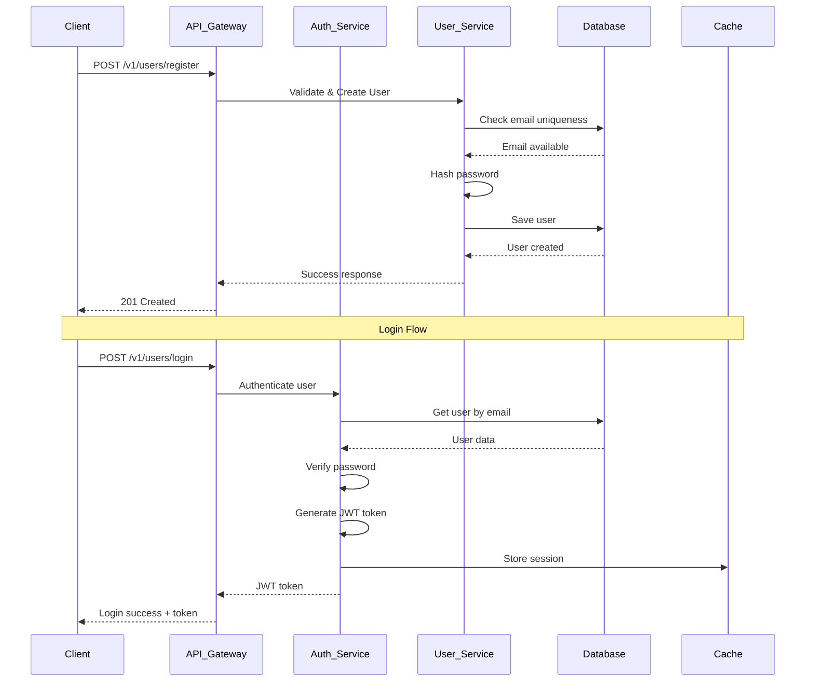
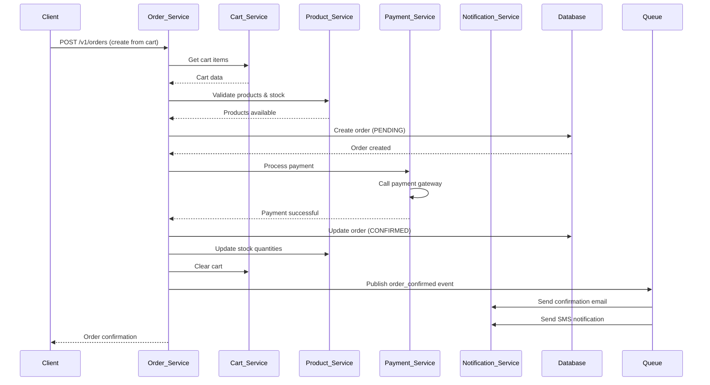
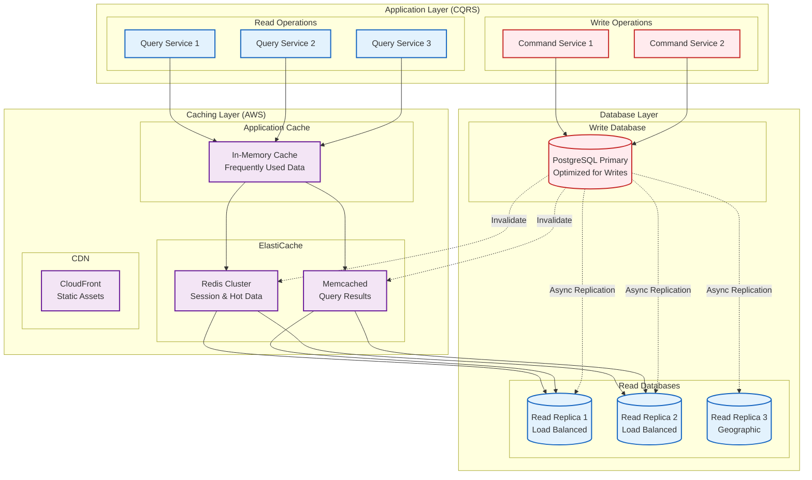
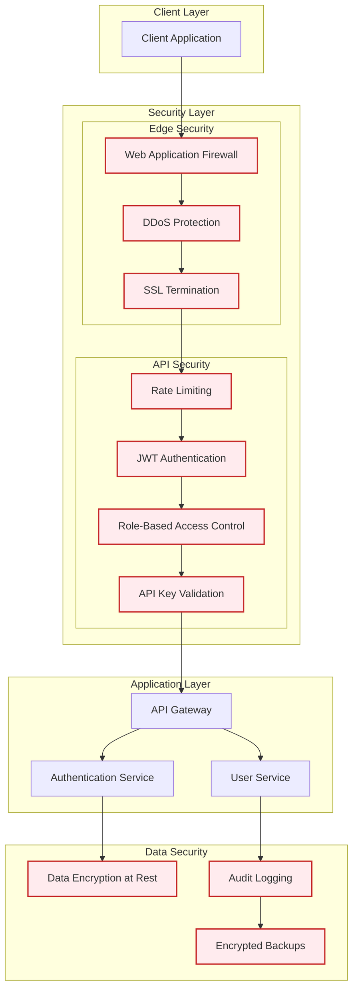
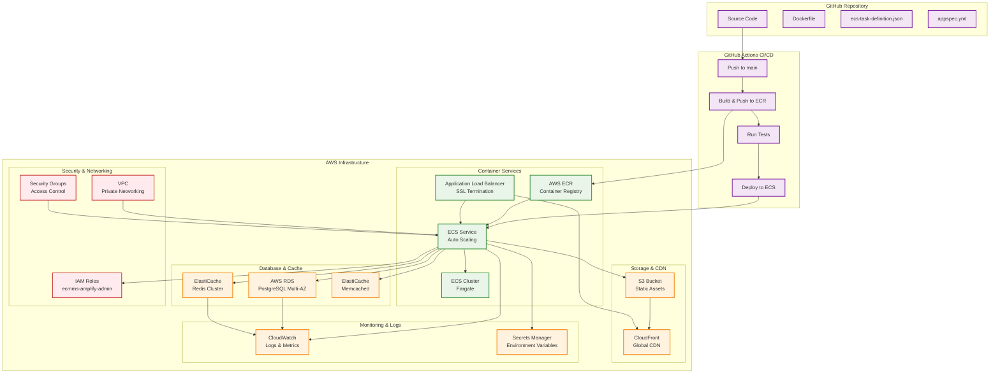

# 📋 Exercise 2: Database Design & System Architecture

This document outlines the comprehensive database design and system architecture for the OPN Commerce Backend, demonstrating scalable e-commerce data modeling and enterprise-grade architectural patterns.

## 🎯 Overview

The system implements a complete e-commerce backend with user management, multi-address support, geolocation services, and product catalog capabilities. The architecture follows Domain-Driven Design (DDD) principles with clear separation of concerns.

## 📊 Database Schema Design

### Entity Relationship Diagram

```mermaid
erDiagram
    User {
        uuid id PK
        varchar email UK "Unique email address"
        varchar password_hash "Bcrypt hashed password"
        varchar name "Full name"
        date date_of_birth "Date of birth"
        enum gender "MALE|FEMALE|OTHER"
        boolean subscribed_to_newsletter "Newsletter subscription"
        timestamp created_at "Creation timestamp"
        timestamp updated_at "Last update timestamp"
        timestamp deleted_at "Soft deletion timestamp"
    }

    UserAddress {
        uuid id PK
        uuid user_id FK "References User.id"
        varchar street "Street address"
        varchar city "City name"
        varchar state "State/Province"
        varchar postal_code "Postal/ZIP code"
        varchar country "Country name"
        enum type "HOME|WORK|BILLING|SHIPPING|OTHER"
        varchar label "User-defined label"
        boolean is_default "Default address flag"
        decimal latitude "GPS latitude (-90 to 90)"
        decimal longitude "GPS longitude (-180 to 180)"
        text delivery_instructions "Optional delivery notes"
        timestamp created_at "Creation timestamp"
        timestamp updated_at "Last update timestamp"
        timestamp deleted_at "Soft deletion timestamp"
    }

    Category {
        uuid id PK
        varchar name "Category name"
        varchar slug "URL-friendly identifier"
        text description "Category description"
        uuid parent_id FK "Self-reference for hierarchy"
        varchar image_url "Category image"
        boolean is_active "Active status"
        integer sort_order "Display order"
        timestamp created_at "Creation timestamp"
        timestamp updated_at "Last update timestamp"
    }

    Product {
        uuid id PK
        varchar name "Product name"
        varchar slug "URL-friendly identifier"
        text description "Product description"
        text short_description "Brief product summary"
        varchar sku "Stock Keeping Unit"
        decimal price "Base price"
        decimal sale_price "Discounted price"
        integer stock_quantity "Available inventory"
        boolean manage_stock "Track inventory"
        boolean in_stock "Stock status"
        enum status "DRAFT|ACTIVE|INACTIVE|ARCHIVED"
        decimal weight "Product weight"
        varchar dimensions "Length x Width x Height"
        json attributes "Product attributes (color, size, etc)"
        varchar featured_image "Main product image"
        json images "Product image gallery"
        decimal average_rating "Average customer rating"
        integer review_count "Number of reviews"
        timestamp created_at "Creation timestamp"
        timestamp updated_at "Last update timestamp"
        timestamp deleted_at "Soft deletion timestamp"
    }

    ProductCategory {
        uuid product_id FK "References Product.id"
        uuid category_id FK "References Category.id"
        boolean is_primary "Primary category flag"
        timestamp created_at "Creation timestamp"
    }

    Cart {
        uuid id PK
        uuid user_id FK "References User.id"
        enum status "ACTIVE|ABANDONED|CONVERTED"
        timestamp expires_at "Cart expiration time"
        timestamp created_at "Creation timestamp"
        timestamp updated_at "Last update timestamp"
    }

    CartItem {
        uuid id PK
        uuid cart_id FK "References Cart.id"
        uuid product_id FK "References Product.id"
        integer quantity "Item quantity"
        decimal price "Price at time of adding"
        json product_options "Selected options (size, color, etc)"
        timestamp created_at "Creation timestamp"
        timestamp updated_at "Last update timestamp"
    }

    Order {
        uuid id PK
        varchar order_number "Human-readable order ID"
        uuid user_id FK "References User.id"
        enum status "PENDING|CONFIRMED|PROCESSING|SHIPPED|DELIVERED|CANCELLED|REFUNDED"
        decimal subtotal "Items total"
        decimal tax_amount "Tax amount"
        decimal shipping_amount "Shipping cost"
        decimal discount_amount "Discount applied"
        decimal total_amount "Final total"
        varchar currency "Currency code (THB, USD, etc)"
        json billing_address "Billing address snapshot"
        json shipping_address "Shipping address snapshot"
        varchar payment_method "Payment method used"
        enum payment_status "PENDING|PAID|FAILED|REFUNDED"
        varchar tracking_number "Shipping tracking number"
        text notes "Order notes"
        timestamp confirmed_at "Order confirmation time"
        timestamp shipped_at "Shipping time"
        timestamp delivered_at "Delivery time"
        timestamp created_at "Creation timestamp"
        timestamp updated_at "Last update timestamp"
    }

    OrderItem {
        uuid id PK
        uuid order_id FK "References Order.id"
        uuid product_id FK "References Product.id"
        varchar product_name "Product name at time of order"
        varchar product_sku "Product SKU at time of order"
        integer quantity "Ordered quantity"
        decimal price "Price at time of order"
        json product_options "Selected options"
        timestamp created_at "Creation timestamp"
    }

    Review {
        uuid id PK
        uuid user_id FK "References User.id"
        uuid product_id FK "References Product.id"
        uuid order_id FK "References Order.id"
        integer rating "Rating (1-5 stars)"
        varchar title "Review title"
        text content "Review content"
        boolean is_verified "Verified purchase"
        boolean is_featured "Featured review"
        enum status "PENDING|APPROVED|REJECTED"
        timestamp created_at "Creation timestamp"
        timestamp updated_at "Last update timestamp"
    }

    Wishlist {
        uuid id PK
        uuid user_id FK "References User.id"
        varchar name "Wishlist name"
        boolean is_default "Default wishlist flag"
        enum privacy "PRIVATE|PUBLIC|SHARED"
        timestamp created_at "Creation timestamp"
        timestamp updated_at "Last update timestamp"
    }

    WishlistItem {
        uuid id PK
        uuid wishlist_id FK "References Wishlist.id"
        uuid product_id FK "References Product.id"
        text notes "Item notes"
        timestamp created_at "Creation timestamp"
    }

    %% Relationships
    User ||--o{ UserAddress : "has multiple addresses"
    User ||--o{ Cart : "has carts"
    User ||--o{ Order : "places orders"
    User ||--o{ Review : "writes reviews"
    User ||--o{ Wishlist : "creates wishlists"

    Category ||--o{ Category : "parent-child hierarchy"
    Category ||--o{ ProductCategory : "categorizes products"
    
    Product ||--o{ ProductCategory : "belongs to categories"
    Product ||--o{ CartItem : "added to carts"
    Product ||--o{ OrderItem : "ordered items"
    Product ||--o{ Review : "receives reviews"
    Product ||--o{ WishlistItem : "saved to wishlists"

    Cart ||--o{ CartItem : "contains items"
    Order ||--o{ OrderItem : "contains items"
    Wishlist ||--o{ WishlistItem : "contains items"

    ProductCategory }|--|| Product : ""
    ProductCategory }|--|| Category : ""
```



## 🏗️ System Architecture

### High-Level Architecture Diagram

```mermaid
graph TB
    subgraph "Client Layer"
        WEB[Web Frontend]
        MOBILE[Mobile App]
        API_DOCS[API Documentation]
    end

    subgraph "Load Balancer"
        ALB[Application Load Balancer]
    end

    subgraph "Application Layer"
        subgraph "API Gateway"
            GATEWAY[NestJS API Gateway]
            AUTH[Authentication Service]
            RATE[Rate Limiting]
        end
        
        subgraph "Microservices"
            USER_SVC[User Service]
            PRODUCT_SVC[Product Service]
            ORDER_SVC[Order Service]
            CART_SVC[Cart Service]
            PAYMENT_SVC[Payment Service]
            NOTIFICATION_SVC[Notification Service]
        end
    end

    subgraph "Data Layer"
        subgraph "Primary Database"
            POSTGRES[(PostgreSQL<br/>Primary)]
            READ_REPLICA[(PostgreSQL<br/>Read Replica)]
        end
        
        subgraph "Caching Layer"
            REDIS[(Redis<br/>Cache & Sessions)]
            MEMCACHED[(Memcached<br/>Query Cache)]
        end
        
        subgraph "Search & Analytics"
            ELASTICSEARCH[(Elasticsearch<br/>Product Search)]
            ANALYTICS[(Analytics DB<br/>ClickHouse)]
        end
    end

    subgraph "External Services"
        PAYMENT_GATEWAY[Payment Gateway<br/>Stripe, PayPal]
        SHIPPING[Shipping APIs<br/>DHL, FedEx]
        EMAIL[Email Service<br/>SendGrid]
        SMS[SMS Service<br/>Twilio]
        GEOCODING[Geocoding API<br/>Google Maps]
    end

    subgraph "Infrastructure"
        subgraph "Monitoring"
            METRICS[Prometheus]
            LOGGING[ELK Stack]
            TRACING[Jaeger]
        end
        
        subgraph "Message Queue"
            RABBITMQ[RabbitMQ]
            SQS[AWS SQS]
        end
        
        subgraph "File Storage"
            S3[AWS S3<br/>Images & Files]
            CDN[CloudFront CDN]
        end
    end

    %% Client connections
    WEB --> ALB
    MOBILE --> ALB
    API_DOCS --> ALB

    %% Load balancer to API Gateway
    ALB --> GATEWAY

    %% API Gateway to services
    GATEWAY --> AUTH
    GATEWAY --> RATE
    GATEWAY --> USER_SVC
    GATEWAY --> PRODUCT_SVC
    GATEWAY --> ORDER_SVC
    GATEWAY --> CART_SVC

    %% Service dependencies
    USER_SVC --> POSTGRES
    USER_SVC --> REDIS
    PRODUCT_SVC --> POSTGRES
    PRODUCT_SVC --> ELASTICSEARCH
    ORDER_SVC --> POSTGRES
    ORDER_SVC --> PAYMENT_SVC
    CART_SVC --> REDIS
    
    %% Payment and notifications
    PAYMENT_SVC --> PAYMENT_GATEWAY
    NOTIFICATION_SVC --> EMAIL
    NOTIFICATION_SVC --> SMS
    
    %% External integrations
    USER_SVC --> GEOCODING
    ORDER_SVC --> SHIPPING
    
    %% Data replication
    POSTGRES --> READ_REPLICA
    
    %% Message queues
    ORDER_SVC --> RABBITMQ
    NOTIFICATION_SVC --> RABBITMQ
    
    %% File storage
    PRODUCT_SVC --> S3
    S3 --> CDN
    
    %% Monitoring
    USER_SVC --> METRICS
    PRODUCT_SVC --> METRICS
    ORDER_SVC --> LOGGING

    %% Styling
    classDef clientClass fill:#e1f5fe,stroke:#01579b,stroke-width:2px
    classDef appClass fill:#f3e5f5,stroke:#4a148c,stroke-width:2px
    classDef dataClass fill:#e8f5e8,stroke:#1b5e20,stroke-width:2px
    classDef externalClass fill:#fff3e0,stroke:#e65100,stroke-width:2px
    classDef infraClass fill:#fce4ec,stroke:#880e4f,stroke-width:2px

    class WEB,MOBILE,API_DOCS clientClass
    class GATEWAY,AUTH,RATE,USER_SVC,PRODUCT_SVC,ORDER_SVC,CART_SVC,PAYMENT_SVC,NOTIFICATION_SVC appClass
    class POSTGRES,READ_REPLICA,REDIS,MEMCACHED,ELASTICSEARCH,ANALYTICS dataClass
    class PAYMENT_GATEWAY,SHIPPING,EMAIL,SMS,GEOCODING externalClass
    class METRICS,LOGGING,TRACING,RABBITMQ,SQS,S3,CDN infraClass
```



## 🔄 Data Flow Architecture

### User Registration & Authentication Flow



### Order Processing Flow



## 📈 Scalability Patterns

### Database Scaling Strategy

Our system leverages **CQRS (Command Query Responsibility Segregation)** pattern, allowing us to use a simpler and more maintainable scaling approach without the complexity of sharding.



#### Key Benefits of CQRS-based Scaling:

1. **Simplified Architecture**: No complex sharding logic or data distribution
2. **Independent Scaling**: Scale reads and writes independently based on actual load
3. **Optimized Performance**: 
   - Write database optimized for transactional consistency
   - Read replicas optimized for complex queries and reporting
4. **Cache Strategy**:
   - **L1 Cache**: In-memory application cache for immediate response
   - **AWS ElastiCache Redis**: Distributed cache for session data and frequently accessed objects
   - **AWS ElastiCache Memcached**: Query result caching with automatic expiration
   - **CloudFront CDN**: Static asset and API response caching at edge locations

#### AWS ElastiCache Configuration:

```yaml
# Redis Cluster for Session & Object Cache
Redis:
  Engine: redis
  CacheNodeType: cache.r6g.xlarge
  NumCacheNodes: 3
  AutomaticFailoverEnabled: true
  MultiAZEnabled: true
  Features:
    - Session storage
    - Shopping cart data
    - User preferences
    - Hot product data
    - Real-time inventory

# Memcached for Query Results
Memcached:
  Engine: memcached
  CacheNodeType: cache.m6g.large
  NumCacheNodes: 4
  Features:
    - Product search results
    - Category listings
    - Computed aggregations
    - API response caching
```

## 🔒 Security Architecture

### Authentication & Authorization Flow



## 🚀 Deployment Architecture

### AWS ECS Deployment (Following NestJS Guidelines)



#### ECS Task Definition (ecs-task-definition.json):

```json
{
  "family": "opn-commerce-api",
  "networkMode": "awsvpc",
  "requiresCompatibilities": ["FARGATE"],
  "cpu": "1024",
  "memory": "2048",
  "executionRoleArn": "arn:aws:iam::ACCOUNT:role/ecsTaskExecutionRole",
  "taskRoleArn": "arn:aws:iam::ACCOUNT:role/ecmms-amplify-admin",
  "containerDefinitions": [
    {
      "name": "opn-commerce-api",
      "image": "ACCOUNT.dkr.ecr.REGION.amazonaws.com/opn-commerce:latest",
      "portMappings": [
        {
          "containerPort": 8091,
          "protocol": "tcp"
        }
      ],
      "essential": true,
      "environment": [
        {
          "name": "NODE_ENV",
          "value": "production"
        },
        {
          "name": "PORT",
          "value": "8091"
        }
      ],
      "secrets": [
        {
          "name": "DATABASE_URL",
          "valueFrom": "arn:aws:secretsmanager:REGION:ACCOUNT:secret:opn-commerce/database-url"
        },
        {
          "name": "REDIS_URL",
          "valueFrom": "arn:aws:secretsmanager:REGION:ACCOUNT:secret:opn-commerce/redis-url"
        },
        {
          "name": "JWT_SECRET",
          "valueFrom": "arn:aws:secretsmanager:REGION:ACCOUNT:secret:opn-commerce/jwt-secret"
        }
      ],
      "logConfiguration": {
        "logDriver": "awslogs",
        "options": {
          "awslogs-group": "/ecs/opn-commerce",
          "awslogs-region": "REGION",
          "awslogs-stream-prefix": "ecs"
        }
      },
      "healthCheck": {
        "command": [
          "CMD-SHELL",
          "curl -f http://localhost:8091/health || exit 1"
        ],
        "interval": 30,
        "timeout": 5,
        "retries": 3,
        "startPeriod": 60
      }
    }
  ]
}
```

#### GitHub Actions AWS ECS Deployment (.github/workflows/deploy.yml):

```yaml
name: Deploy to AWS ECS

on:
  push:
    branches: [main]

env:
  AWS_REGION: us-east-1
  ECR_REPOSITORY: opn-commerce
  ECS_SERVICE: opn-commerce-service
  ECS_CLUSTER: opn-commerce-cluster
  ECS_TASK_DEFINITION: ecs-task-definition.json
  CONTAINER_NAME: opn-commerce-api

jobs:
  deploy:
    name: Deploy to ECS
    runs-on: ubuntu-latest
    environment: production

    steps:
    - name: Checkout
      uses: actions/checkout@v3

    - name: Configure AWS credentials
      uses: aws-actions/configure-aws-credentials@v2
      with:
        aws-access-key-id: ${{ secrets.AWS_ACCESS_KEY_ID }}
        aws-secret-access-key: ${{ secrets.AWS_SECRET_ACCESS_KEY }}
        aws-region: ${{ env.AWS_REGION }}
        role-to-assume: arn:aws:iam::${{ secrets.AWS_ACCOUNT_ID }}:role/ecmms-amplify-admin

    - name: Login to Amazon ECR
      id: login-ecr
      uses: aws-actions/amazon-ecr-login@v1

    - name: Build, tag, and push image to Amazon ECR
      id: build-image
      env:
        ECR_REGISTRY: ${{ steps.login-ecr.outputs.registry }}
        IMAGE_TAG: ${{ github.sha }}
      run: |
        docker build -t $ECR_REGISTRY/$ECR_REPOSITORY:$IMAGE_TAG .
        docker push $ECR_REGISTRY/$ECR_REPOSITORY:$IMAGE_TAG
        echo "image=$ECR_REGISTRY/$ECR_REPOSITORY:$IMAGE_TAG" >> $GITHUB_OUTPUT

    - name: Fill in the new image ID in the Amazon ECS task definition
      id: task-def
      uses: aws-actions/amazon-ecs-render-task-definition@v1
      with:
        task-definition: ${{ env.ECS_TASK_DEFINITION }}
        container-name: ${{ env.CONTAINER_NAME }}
        image: ${{ steps.build-image.outputs.image }}

    - name: Deploy Amazon ECS task definition
      uses: aws-actions/amazon-ecs-deploy-task-definition@v1
      with:
        task-definition: ${{ steps.task-def.outputs.task-definition }}
        service: ${{ env.ECS_SERVICE }}
        cluster: ${{ env.ECS_CLUSTER }}
        wait-for-service-stability: true
```

#### Dockerfile for AWS ECS:

```dockerfile
# Multi-stage build for production
FROM node:18-alpine AS builder

WORKDIR /app
COPY package*.json ./
RUN npm ci --only=production && npm cache clean --force

FROM node:18-alpine AS production

# Install curl for health checks
RUN apk add --no-cache curl

WORKDIR /app
COPY --from=builder /app/node_modules ./node_modules
COPY . .

# Build the application
RUN npm run build

# Create non-root user
RUN addgroup -g 1001 -S nodejs
RUN adduser -S nestjs -u 1001
USER nestjs

EXPOSE 8091

# Use PM2 for production process management
RUN npm install pm2 -g
COPY ecosystem.config.js .

CMD ["pm2-runtime", "start", "ecosystem.config.js"]
```

#### Key Benefits:

1. **AWS Native**: Full integration with AWS services and best practices
2. **Auto Scaling**: ECS Fargate automatically scales based on demand
3. **Secure**: Uses IAM roles and Secrets Manager for credential management
4. **Monitoring**: CloudWatch integration for logs and metrics
5. **High Availability**: Multi-AZ deployment with load balancer
6. **Cost Optimized**: Pay only for what you use with Fargate
