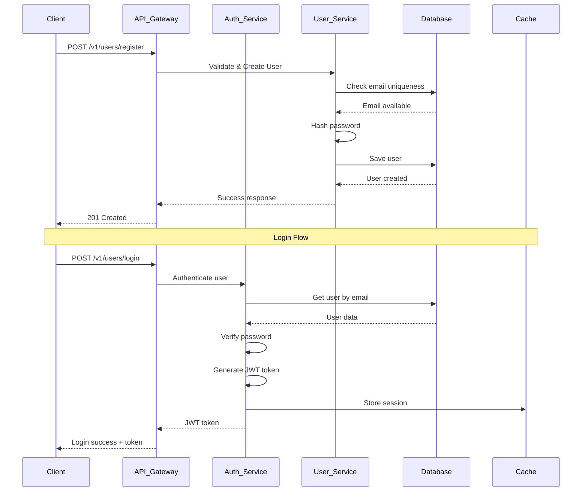
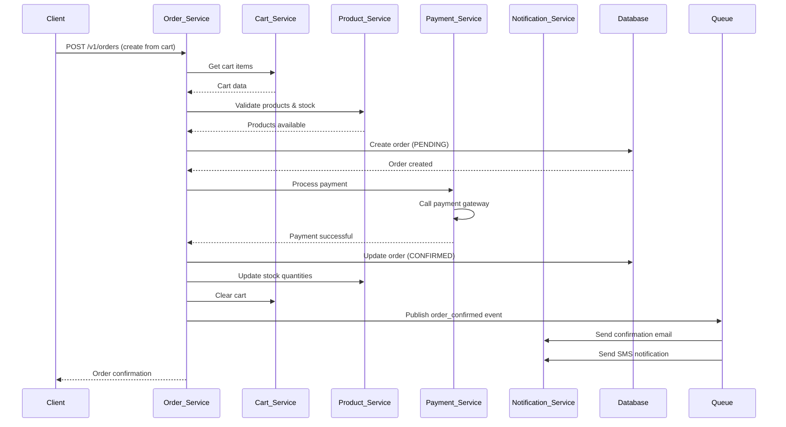
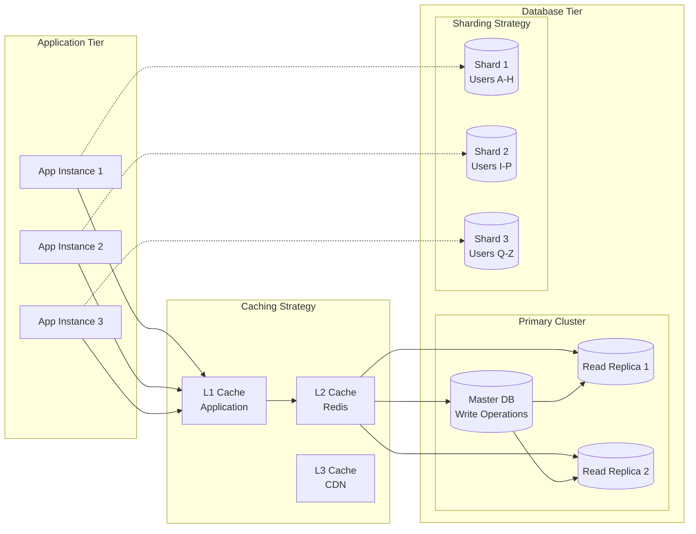
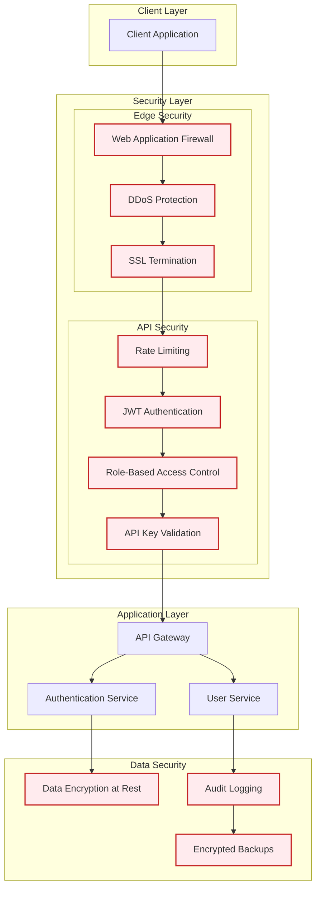
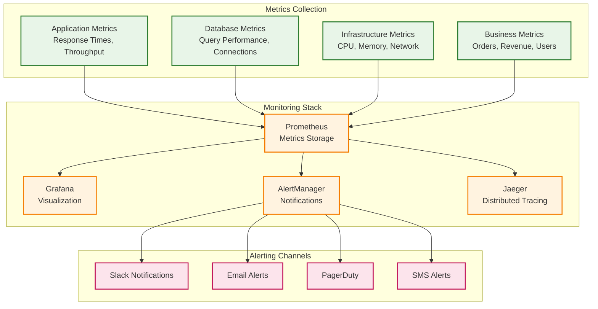
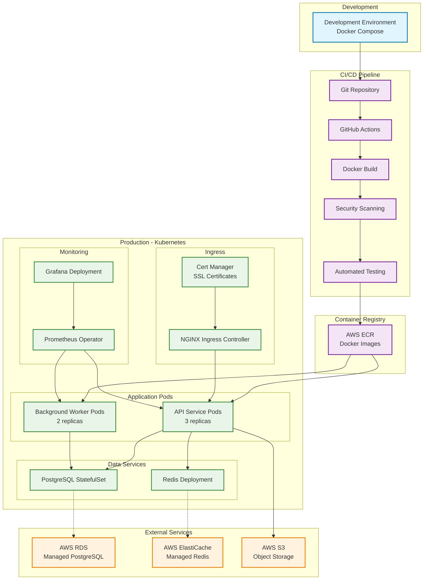

# 📋 Exercise 2: Database Design & System Architecture

This document outlines the comprehensive database design and system architecture for the OPN Commerce Backend, demonstrating scalable e-commerce data modeling and enterprise-grade architectural patterns.

## 🎯 Overview

The system implements a complete e-commerce backend with user management, multi-address support, geolocation services, and product catalog capabilities. The architecture follows Domain-Driven Design (DDD) principles with clear separation of concerns.

## 📊 Database Schema Design

### Entity Relationship Diagram

```mermaid
erDiagram
    User {
        uuid id PK
        varchar email UK "Unique email address"
        varchar password_hash "Bcrypt hashed password"
        varchar name "Full name"
        date date_of_birth "Date of birth"
        enum gender "MALE|FEMALE|OTHER"
        boolean subscribed_to_newsletter "Newsletter subscription"
        timestamp created_at "Creation timestamp"
        timestamp updated_at "Last update timestamp"
        timestamp deleted_at "Soft deletion timestamp"
    }

    UserAddress {
        uuid id PK
        uuid user_id FK "References User.id"
        varchar street "Street address"
        varchar city "City name"
        varchar state "State/Province"
        varchar postal_code "Postal/ZIP code"
        varchar country "Country name"
        enum type "HOME|WORK|BILLING|SHIPPING|OTHER"
        varchar label "User-defined label"
        boolean is_default "Default address flag"
        decimal latitude "GPS latitude (-90 to 90)"
        decimal longitude "GPS longitude (-180 to 180)"
        text delivery_instructions "Optional delivery notes"
        timestamp created_at "Creation timestamp"
        timestamp updated_at "Last update timestamp"
        timestamp deleted_at "Soft deletion timestamp"
    }

    Category {
        uuid id PK
        varchar name "Category name"
        varchar slug "URL-friendly identifier"
        text description "Category description"
        uuid parent_id FK "Self-reference for hierarchy"
        varchar image_url "Category image"
        boolean is_active "Active status"
        integer sort_order "Display order"
        timestamp created_at "Creation timestamp"
        timestamp updated_at "Last update timestamp"
    }

    Product {
        uuid id PK
        varchar name "Product name"
        varchar slug "URL-friendly identifier"
        text description "Product description"
        text short_description "Brief product summary"
        varchar sku "Stock Keeping Unit"
        decimal price "Base price"
        decimal sale_price "Discounted price"
        integer stock_quantity "Available inventory"
        boolean manage_stock "Track inventory"
        boolean in_stock "Stock status"
        enum status "DRAFT|ACTIVE|INACTIVE|ARCHIVED"
        decimal weight "Product weight"
        varchar dimensions "Length x Width x Height"
        json attributes "Product attributes (color, size, etc)"
        varchar featured_image "Main product image"
        json images "Product image gallery"
        decimal average_rating "Average customer rating"
        integer review_count "Number of reviews"
        timestamp created_at "Creation timestamp"
        timestamp updated_at "Last update timestamp"
        timestamp deleted_at "Soft deletion timestamp"
    }

    ProductCategory {
        uuid product_id FK "References Product.id"
        uuid category_id FK "References Category.id"
        boolean is_primary "Primary category flag"
        timestamp created_at "Creation timestamp"
    }

    Cart {
        uuid id PK
        uuid user_id FK "References User.id"
        enum status "ACTIVE|ABANDONED|CONVERTED"
        timestamp expires_at "Cart expiration time"
        timestamp created_at "Creation timestamp"
        timestamp updated_at "Last update timestamp"
    }

    CartItem {
        uuid id PK
        uuid cart_id FK "References Cart.id"
        uuid product_id FK "References Product.id"
        integer quantity "Item quantity"
        decimal price "Price at time of adding"
        json product_options "Selected options (size, color, etc)"
        timestamp created_at "Creation timestamp"
        timestamp updated_at "Last update timestamp"
    }

    Order {
        uuid id PK
        varchar order_number "Human-readable order ID"
        uuid user_id FK "References User.id"
        enum status "PENDING|CONFIRMED|PROCESSING|SHIPPED|DELIVERED|CANCELLED|REFUNDED"
        decimal subtotal "Items total"
        decimal tax_amount "Tax amount"
        decimal shipping_amount "Shipping cost"
        decimal discount_amount "Discount applied"
        decimal total_amount "Final total"
        varchar currency "Currency code (THB, USD, etc)"
        json billing_address "Billing address snapshot"
        json shipping_address "Shipping address snapshot"
        varchar payment_method "Payment method used"
        enum payment_status "PENDING|PAID|FAILED|REFUNDED"
        varchar tracking_number "Shipping tracking number"
        text notes "Order notes"
        timestamp confirmed_at "Order confirmation time"
        timestamp shipped_at "Shipping time"
        timestamp delivered_at "Delivery time"
        timestamp created_at "Creation timestamp"
        timestamp updated_at "Last update timestamp"
    }

    OrderItem {
        uuid id PK
        uuid order_id FK "References Order.id"
        uuid product_id FK "References Product.id"
        varchar product_name "Product name at time of order"
        varchar product_sku "Product SKU at time of order"
        integer quantity "Ordered quantity"
        decimal price "Price at time of order"
        json product_options "Selected options"
        timestamp created_at "Creation timestamp"
    }

    Review {
        uuid id PK
        uuid user_id FK "References User.id"
        uuid product_id FK "References Product.id"
        uuid order_id FK "References Order.id"
        integer rating "Rating (1-5 stars)"
        varchar title "Review title"
        text content "Review content"
        boolean is_verified "Verified purchase"
        boolean is_featured "Featured review"
        enum status "PENDING|APPROVED|REJECTED"
        timestamp created_at "Creation timestamp"
        timestamp updated_at "Last update timestamp"
    }

    Wishlist {
        uuid id PK
        uuid user_id FK "References User.id"
        varchar name "Wishlist name"
        boolean is_default "Default wishlist flag"
        enum privacy "PRIVATE|PUBLIC|SHARED"
        timestamp created_at "Creation timestamp"
        timestamp updated_at "Last update timestamp"
    }

    WishlistItem {
        uuid id PK
        uuid wishlist_id FK "References Wishlist.id"
        uuid product_id FK "References Product.id"
        text notes "Item notes"
        timestamp created_at "Creation timestamp"
    }

    %% Relationships
    User ||--o{ UserAddress : "has multiple addresses"
    User ||--o{ Cart : "has carts"
    User ||--o{ Order : "places orders"
    User ||--o{ Review : "writes reviews"
    User ||--o{ Wishlist : "creates wishlists"

    Category ||--o{ Category : "parent-child hierarchy"
    Category ||--o{ ProductCategory : "categorizes products"
    
    Product ||--o{ ProductCategory : "belongs to categories"
    Product ||--o{ CartItem : "added to carts"
    Product ||--o{ OrderItem : "ordered items"
    Product ||--o{ Review : "receives reviews"
    Product ||--o{ WishlistItem : "saved to wishlists"

    Cart ||--o{ CartItem : "contains items"
    Order ||--o{ OrderItem : "contains items"
    Wishlist ||--o{ WishlistItem : "contains items"

    ProductCategory }|--|| Product : ""
    ProductCategory }|--|| Category : ""
```



## 🏗️ System Architecture

### High-Level Architecture Diagram

```mermaid
graph TB
    subgraph "Client Layer"
        WEB[Web Frontend]
        MOBILE[Mobile App]
        API_DOCS[API Documentation]
    end

    subgraph "Load Balancer"
        ALB[Application Load Balancer]
    end

    subgraph "Application Layer"
        subgraph "API Gateway"
            GATEWAY[NestJS API Gateway]
            AUTH[Authentication Service]
            RATE[Rate Limiting]
        end
        
        subgraph "Microservices"
            USER_SVC[User Service]
            PRODUCT_SVC[Product Service]
            ORDER_SVC[Order Service]
            CART_SVC[Cart Service]
            PAYMENT_SVC[Payment Service]
            NOTIFICATION_SVC[Notification Service]
        end
    end

    subgraph "Data Layer"
        subgraph "Primary Database"
            POSTGRES[(PostgreSQL<br/>Primary)]
            READ_REPLICA[(PostgreSQL<br/>Read Replica)]
        end
        
        subgraph "Caching Layer"
            REDIS[(Redis<br/>Cache & Sessions)]
            MEMCACHED[(Memcached<br/>Query Cache)]
        end
        
        subgraph "Search & Analytics"
            ELASTICSEARCH[(Elasticsearch<br/>Product Search)]
            ANALYTICS[(Analytics DB<br/>ClickHouse)]
        end
    end

    subgraph "External Services"
        PAYMENT_GATEWAY[Payment Gateway<br/>(Stripe, PayPal)]
        SHIPPING[Shipping APIs<br/>(DHL, FedEx)]
        EMAIL[Email Service<br/>(SendGrid)]
        SMS[SMS Service<br/>(Twilio)]
        GEOCODING[Geocoding API<br/>(Google Maps)]
    end

    subgraph "Infrastructure"
        subgraph "Monitoring"
            METRICS[Prometheus]
            LOGGING[ELK Stack]
            TRACING[Jaeger]
        end
        
        subgraph "Message Queue"
            RABBITMQ[RabbitMQ]
            SQS[AWS SQS]
        end
        
        subgraph "File Storage"
            S3[AWS S3<br/>Images & Files]
            CDN[CloudFront CDN]
        end
    end

    %% Client connections
    WEB --> ALB
    MOBILE --> ALB
    API_DOCS --> ALB

    %% Load balancer to API Gateway
    ALB --> GATEWAY

    %% API Gateway to services
    GATEWAY --> AUTH
    GATEWAY --> RATE
    GATEWAY --> USER_SVC
    GATEWAY --> PRODUCT_SVC
    GATEWAY --> ORDER_SVC
    GATEWAY --> CART_SVC

    %% Service dependencies
    USER_SVC --> POSTGRES
    USER_SVC --> REDIS
    PRODUCT_SVC --> POSTGRES
    PRODUCT_SVC --> ELASTICSEARCH
    ORDER_SVC --> POSTGRES
    ORDER_SVC --> PAYMENT_SVC
    CART_SVC --> REDIS
    
    %% Payment and notifications
    PAYMENT_SVC --> PAYMENT_GATEWAY
    NOTIFICATION_SVC --> EMAIL
    NOTIFICATION_SVC --> SMS
    
    %% External integrations
    USER_SVC --> GEOCODING
    ORDER_SVC --> SHIPPING
    
    %% Data replication
    POSTGRES --> READ_REPLICA
    
    %% Message queues
    ORDER_SVC --> RABBITMQ
    NOTIFICATION_SVC --> RABBITMQ
    
    %% File storage
    PRODUCT_SVC --> S3
    S3 --> CDN
    
    %% Monitoring
    USER_SVC --> METRICS
    PRODUCT_SVC --> METRICS
    ORDER_SVC --> LOGGING

    %% Styling
    classDef clientClass fill:#e1f5fe,stroke:#01579b,stroke-width:2px
    classDef appClass fill:#f3e5f5,stroke:#4a148c,stroke-width:2px
    classDef dataClass fill:#e8f5e8,stroke:#1b5e20,stroke-width:2px
    classDef externalClass fill:#fff3e0,stroke:#e65100,stroke-width:2px
    classDef infraClass fill:#fce4ec,stroke:#880e4f,stroke-width:2px

    class WEB,MOBILE,API_DOCS clientClass
    class GATEWAY,AUTH,RATE,USER_SVC,PRODUCT_SVC,ORDER_SVC,CART_SVC,PAYMENT_SVC,NOTIFICATION_SVC appClass
    class POSTGRES,READ_REPLICA,REDIS,MEMCACHED,ELASTICSEARCH,ANALYTICS dataClass
    class PAYMENT_GATEWAY,SHIPPING,EMAIL,SMS,GEOCODING externalClass
    class METRICS,LOGGING,TRACING,RABBITMQ,SQS,S3,CDN infraClass
```

## 🔄 Data Flow Architecture

### User Registration & Authentication Flow



### Order Processing Flow



## 📈 Scalability Patterns

### Database Scaling Strategy



## 🔒 Security Architecture

### Authentication & Authorization Flow



## 📊 Performance Monitoring

### System Monitoring Dashboard



## 🚀 Deployment Architecture

### Container Orchestration



## 📋 Implementation Checklist

### Phase 1: Core Foundation ✅
- [x] User management with authentication
- [x] Multi-address support with geolocation
- [x] JWT-based security system
- [x] PostgreSQL database adapter
- [x] Comprehensive API documentation

### Phase 2: E-commerce Core (Planned)
- [ ] Product catalog management
- [ ] Category hierarchy
- [ ] Shopping cart functionality
- [ ] Order processing system
- [ ] Payment integration

### Phase 3: Advanced Features (Future)
- [ ] Search and filtering (Elasticsearch)
- [ ] Review and rating system
- [ ] Wishlist functionality
- [ ] Inventory management
- [ ] Analytics and reporting

### Phase 4: Scalability & Performance (Future)
- [ ] Microservices architecture
- [ ] Event-driven communication
- [ ] Advanced caching strategies
- [ ] Database sharding
- [ ] CDN integration

## 🏆 Technical Highlights

### Current Implementation
- **Domain-Driven Design**: Clear business logic separation
- **CQRS Pattern**: Optimized read/write operations
- **Onion Architecture**: Dependency inversion principles
- **Database Adapter Pattern**: Flexible data persistence
- **JWT Authentication**: Secure, stateless authentication
- **Type Safety**: Full TypeScript implementation

### Future Scalability
- **Horizontal Scaling**: Kubernetes-based orchestration
- **Database Scaling**: Read replicas and sharding strategies
- **Caching Layers**: Multi-level caching architecture
- **Event Sourcing**: Audit trails and event replay capabilities
- **Microservices**: Service decomposition for scalability

---

This architecture supports enterprise-grade e-commerce applications with the flexibility to scale from startup to enterprise levels while maintaining code quality, security, and performance standards.