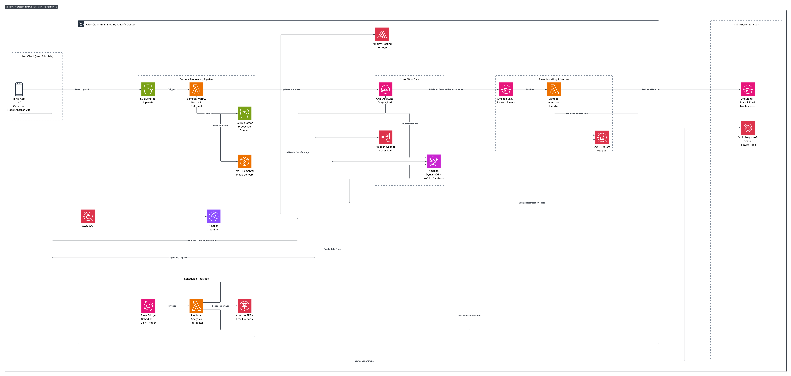

## 4. Solution Architecture

This section proposes a microservices architecture for an MVP Instagram-like application, prioritizing time-to-market, cost-effectiveness, and extensibility using serverless services on AWS and specialized third-party services.

### Architecture Diagram


<details>
<summary>📋 View Mermaid Code (Click to expand)</summary>

```mermaid
graph TD
    subgraph "User Client (Web & Mobile)"
        Client[Ionic App w/ Capacitor (React/Angular/Vue)]
    end

    subgraph "Third-Party Services"
        OneSignal[OneSignal - Push & Email Notifications]
        Optimizely[Optimizely - A/B Testing & Feature Flags]
    end

    subgraph "AWS Cloud (Managed by Amplify Gen 2)"
        WAF[AWS WAF]
        CDN[Amazon CloudFront]
        AmplifyHosting[Amplify Hosting for Web]

        subgraph "Core API & Data"
            API[AWS AppSync - GraphQL API]
            Auth[Amazon Cognito - User Auth]
            DB[Amazon DynamoDB - NoSQL Database]
        end

        subgraph "Content Processing Pipeline"
            S3_Upload[S3 Bucket for Uploads] -->|Triggers| Lambda_Process[Lambda: Verify, Resize & Reformat]
            Lambda_Process -->|Saves to| S3_Processed[S3 Bucket for Processed Content]
            Lambda_Process -->|Updates Metadata| API
            MediaConvert[AWS Elemental MediaConvert]
            Lambda_Process -- "Uses for Video" --> MediaConvert
        end

        subgraph "Event Handling & Secrets"
            SNS[Amazon SNS - Fan-out Events]
            Lambda_Interact[Lambda: Interaction Handler]
            SecretsManager[AWS Secrets Manager]
        end
        
        subgraph "Scheduled Analytics"
            EventBridge[EventBridge Scheduler - Daily Trigger]
            Lambda_Analytics[Lambda: Analytics Aggregator]
            SES_Report[Amazon SES - Email Reports]
        end
    end

    %% --- Connections ---
    Client -- "HTTP Requests" --> WAF
    WAF --> CDN
    CDN --> AmplifyHosting
    CDN -- "API Calls /auth/storage" --> API
    
    Client -- "Signs up / Logs in" --> Auth
    Client -- "GraphQL Queries/Mutations" --> API
    Client -- "Direct Upload" --> S3_Upload
    Client -- "Fetches Experiments" --> Optimizely

    API -- "CRUD Operations" --> DB
    API -- "Publishes Events (Like, Comment)" --> SNS
    API -- "Real-time Messaging (Chat)" -->|Via AppSync Subscriptions| Client

    SNS -- "Invokes" --> Lambda_Interact
    Lambda_Interact -- "Updates Notification Table" --> DB
    Lambda_Interact -- "Makes API Call to" --> OneSignal
    Lambda_Interact -- "Retrieves Secrets from" --> SecretsManager
    
    EventBridge -- "Invokes" --> Lambda_Analytics
    Lambda_Analytics -- "Reads Data From" --> DB
    Lambda_Analytics -- "Sends Report via" --> SES_Report
    Lambda_Analytics -- "Retrieves Secrets from" --> SecretsManager
```

</details>

### Architectural Analysis

#### Design Choices

**Amplify Gen 2:** The architecture leverages AWS Amplify Gen 2 for its serverless capabilities, fullstack development, allowing rapid development and deployment of the application. Amplify provides the utility including Auth, API, Storage, Real-time Data, and Hosting.

**Frontend Framework:** The client is built using Ionic with Capacitor. This allows for a single codebase to be deployed as a hybrid app iOS app, Android app, and a Progressive Web App (PWA), dramatically accelerating development.

**Notification Service:** The architecture uses a specialized third-party service like OneSignal for its superior developer experience and rich feature set, aligning with the goal of MVP speed.

**A/B Testing Platform & Feature Flag:** Optimizely is integrated for client-side A/B testing and feature flagging. This empowers the product team to run experiments on UI/UX and feature variations directly, enabling data-driven decisions without requiring backend deployments for each test.

#### Security & Compliance

**Web Application Firewall (WAF):** AWS WAF is placed in front of CloudFront to protect against common web exploits (e.g., XSS, SQL injection) and to provide rate limiting.

**Secure File Uploads & Sanitization:** The Lambda: Verify, Resize & Reformat function is a critical security control. It inspects the file's signature (magic numbers) to confirm it is a genuine image/video file, rejecting any file that doesn't match (e.g., a .php script renamed to .png). It then uses a trusted library to re-process and re-encode the image, stripping potentially malicious EXIF metadata.

**Secrets Management:** All sensitive credentials (e.g., OneSignal API keys) are stored in AWS Secrets Manager, not in code. Lambda functions are granted specific IAM permissions to retrieve secrets at runtime.

**Fine-Grained Authorization:** AWS AppSync resolvers enforce fine-grained authorization rules, ensuring a user can only access or modify their own data and easier integrate with AWS Cognito and user pool.

**Data Encryption:** All data is encrypted both in transit (using TLS 1.2+) and at rest (using default server-side encryption on DynamoDB and S3).

### ✅ Pros
- **Fast Time-to-Market:** The combination of Ionic, AWS Amplify Gen 2, OneSignal, and Optimizely creates a powerful stack for rapid, data-driven, cross-platform development.
- **Low Initial Cost:** The serverless, pay-per-use model is perfect for an MVP.
- **Automatic Scaling:** Services like Lambda, DynamoDB, and AppSync scale automatically.
- **Data-Driven Decisions:** Optimizely enables product iteration based on user behavior rather than guesswork.
- **CICD Ready:** Amplify Gen 2 provides built-in CI/CD capabilities, allowing for automated deployments and separation of the environment configurations (dev, staging, prod).

### ❌ Cons
- **Learning curve:** Using Amplify Gen 2 and integrating multiple third-party services can have a steep learning curve for new developers. and the developer need to be familiar amplify cli and the Amplify Gen 2 features.
- **Stuck with AWS** as use of Amplify Gen 2 ties the architecture closely to AWS services, making it difficult to migrate to other cloud providers in the future.
- **Amplify Gen 2 Limmitations and buggy behavior:** Amplify Gen 2 is still evolving, and some features may not be as stable or well-documented.

### ⚠️ Risks
- **Cost Overruns:** A misconfigured service poses the biggest risk. Mitigation: Implement strict AWS Budgets and Billing Alarms.
- **Complex Feed Logic:** An algorithmic feed is complex and requires advanced data modeling. Mitigation: Start with a simple chronological feed for the MVP.
- **External Service Dependency:** The application's core features rely on the availability of multiple third-party services. Mitigation: Implement robust monitoring, client-side error handling, and graceful degradation.
- **Security Posture Management:** The attack surface increases with each external service. Mitigation: Implement automated security checks in the CI/CD pipeline and regular security audits.

### 🚀 Extensibility
- **Modular Growth:** New features can be added as independent modules without affecting existing services.
- **Event-Driven Flexibility:** Using SNS as an event bus allows for easy addition of new services that react to existing events.
- **Evolving API:** GraphQL allows the API to evolve without versioning, ensuring backward compatibility with older clients.
